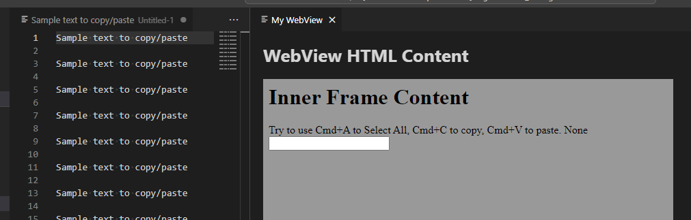

# VS Code Copy/Paste/Select All in iframe Repro

Running this project will show a WebView with an input box in it.

On macOS, shortcuts like `Cmd`+`A` (Select All), `Cmd`+`C` (Copy), `Cmd`+`V` do not work in this input box. On Windows, everything is fine.

]
